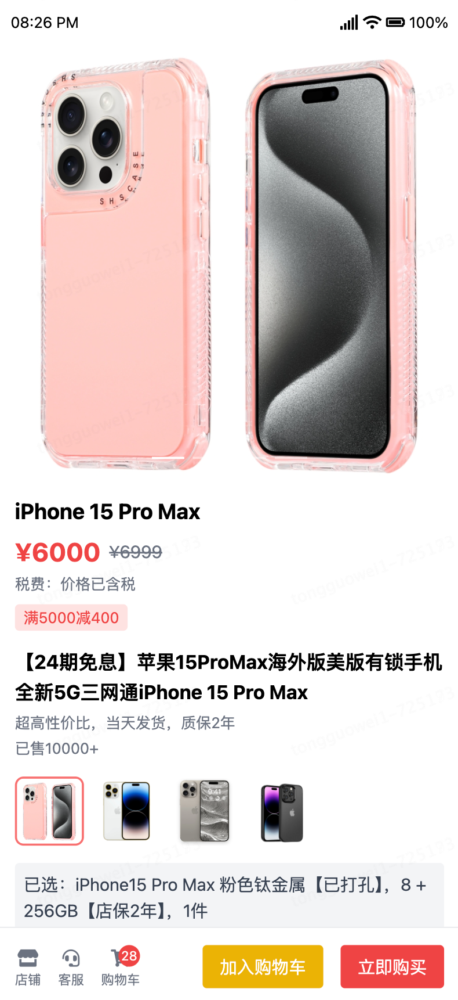
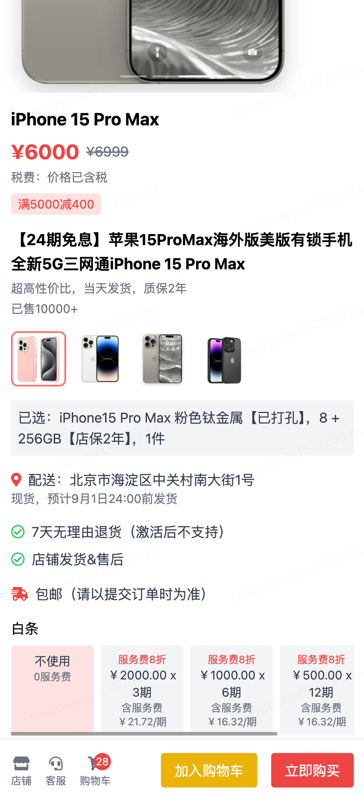
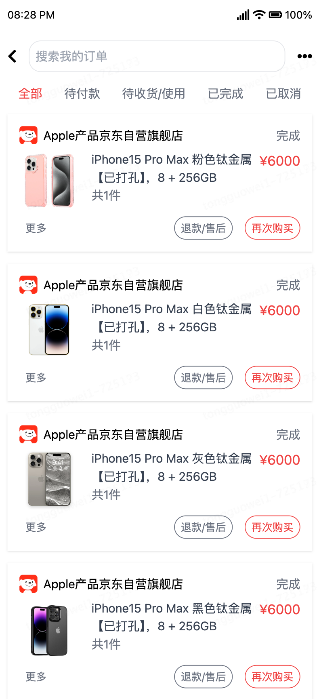

## Introduction

This is a jdmall frontend demo application based on Vue.js, which contains two pages: product detail page and order list page.

## Features

- Product Detail Page: Support selecting products, white-ticket installments, and white-ticket order.
- Order Detail Page: Support viewing order lists, installment repayment plans, etc.

## Tech Stack

- Vue.js: A progressive JavaScript framework for building user interfaces.
- Vite: A next generation frontend build tool.
- Vue-router: Page routing solution for Vue.js.
- Axios: A promise-based HTTP client for the browser and node.js. I used it to handle HTTP requests.
- Tailwind CSS: A utility-first CSS framework for rapidly building custom designs. All page styles are written in Tailwind CSS.
- Element-Plus: For quickly building web applications. I used it to achieve the notification pop-up effect, the product image carousel effect, page loadding effect, etc. It is a good choice for building a complex web application.
- Font-Awesome: For providing the icon font.

## Getting Started

1. Install Node.js

```sh
brew install node
```

2. Clone the repository

```sh
git clone git@github.com:tonngw/jdmall-demo.git
```

3. Install dependencies

```sh
cd jdmall-demo
npm install
```

4. Run the application

```sh
npm run dev
```

5. Open the application in the browser

Visit address: http://localhost:5173/, and you can see the application running.
If the address is not available, you can see the port number in the terminal output, even change the port number in the `package.json` file.

## What to get

You will learn a basic understanding of how to build a frontend application with Vue.js and Vite.js. You will also learn how to use Vue-router, Axios, Tailwind CSS, Element-Plus, and Font-Awesome.

This is a simple demo application, but it can be extended to a more complex one with more features and functions.

The demo is my learning experince, so I hope this demo can help you get started with Vue.js, Vite.js and etc.

## Page Preview

https://github.com/user-attachments/assets/d944703f-873e-4236-bb46-0883be419e6b

---

### Product Detail Page

<br/>
<br/>

### Order List Page


